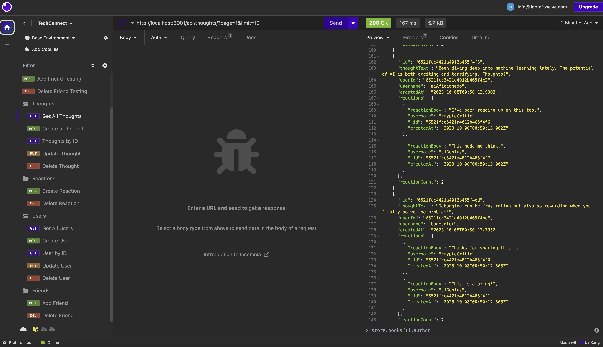

# TechConnect Social Networking Platform

## Overview

TechConnect is a social networking platform that provides users with the capability to share their thoughts, react to the thoughts of others, and establish friendships with other users. It leverages caching for improved performance and offers a simple yet powerful set of features.

## Features

`Thoughts`

- **List All Thoughts** - Retrieve all thoughts, paginated and sorted by creation date. Also calculates and provides the reaction count for each thought.
- **Single Thought Details** - Get detailed information of a specific thought by its ID, including its text, creation date, the user who posted it, and reactions it has received.
- **Create Thought** - Users can post their own thoughts which get saved to the database.
- **Update Thought** - Modify an existing thought by providing its ID.
- **Delete Thought** - Remove a thought from the platform.
- **React to Thoughts** - Users can add reactions to the thoughts of others, but not to their own.
- **Remove Reaction** - A user's reaction can be removed from a thought.

`Users`

- **List All Users** - View all users on the platform, showing their basic details and the thoughts they've shared. Also calculates and provides the friend count for each user.
- **Single User Details** - Get detailed information about a specific user, including their email, thoughts, and friends.
- **Register New User** - A new user can join the platform by providing a unique username and other essential details.
- **Update User Profile** - Modify user details by providing their ID.
- **Delete User** - Remove a user's account from the platform. This also removes the user's associated thoughts.
- **Friendships**:
  - **Add Friend** - Users can establish mutual friendships with others.
  - **Remove Friend** - Users can end their friendships, which is reflected on both profiles.

## Usage Guide

- Clone the repository from GitHub.
- Navigate to the project root and `run npm install` to install all necessary dependencies.
- Set up your `.env` file with necessary environment variables.
- Start the server with `npm start` and explore the endpoints using tools like Postman or Insomnia.

## Screenshots

## Technologies Used

- Node.js
- Mongoose
- Express
- LRU Cache
- DotENV

## Live Demo

// Currently not live

Take a look at the live demo and explore the platform's features: [Watch Here](https://linkhere).

## Credits

This project was independently developed by myself, Victoria Alawi.

- Github: [@lightoftwelve](https://github.com/lightoftwelve)
- LinkedIn: [@Victoria Alawi](https://www.linkedin.com/in/victoria-alawi-872984250/)
- Website: [www.lightoftwelve.com](http://www.lightoftwelve.com)

## License

This project is not currently licensed.
